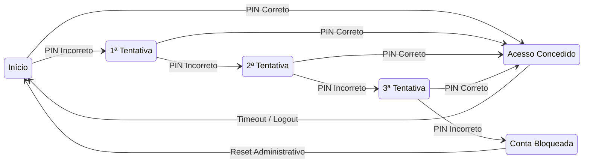

# 🧭 4. State Transition (Transição de Estado)

## 📋 Definição

**State Transition Testing** é uma técnica dinâmica e poderosa de design de testes utilizada para analisar o comportamento de uma aplicação em diferentes condições de entrada e vários estados. É particularmente útil quando o sistema possui um número finito de estados, e as transições entre eles são desencadeadas por eventos ou condições específicas.

### Princípio Fundamental

O foco está nas transições válidas e inválidas entre estados, garantindo que o sistema se comporte corretamente em todas as circunstâncias, incluindo defeitos que outras técnicas não capturam.

---

## 🏗️ Componentes Fundamentais

### **Estados (States)**
- **Definição**: Situações específicas em que o sistema pode existir.
- **Características**: Finitos, bem definidos e mutuamente exclusivos.
- **Exemplos**: Ligado/Desligado, Autenticado/Não autenticado.

### **Eventos (Events)**
- **Definição**: Ações ou triggers que causam mudança de estado.
- **Tipos**: Ações do utilizador, timeouts, dados recebidos.
- **Função**: Disparam transições.

### **Transições (Transitions)**
- **Definição**: Mudanças de estado causadas por eventos.
- **Características**: Instantâneas, com ações específicas.
- **Sintaxe**: `evento [condição de guarda] / ação`.

### **Condições de Guarda (Guard Conditions)**
- **Definição**: Condições para que a transição ocorra.
- **Exemplo**: `[saldo > 0]`.

### **Ações (Actions)**
- **Definição**: Operações executadas durante a transição.
- **Tipos**: Cálculos, atualizações, envio de mensagens.

---

## 🎯 Importância e Aplicabilidade

### **Benefícios Principais**
- Validação de fluxos complexos.
- Verificação de autenticação/autorização.
- Teste de formulários e wizards.
- Deteção de falhas baseadas em histórico.

### **Cenários Ideais**
- Sistemas com múltiplas tentativas de login.
- E-commerce, jogos, workflows, transações financeiras.

---

## 📊 Modelação de Estados

### 1. **Diagrama de Transição de Estados** (Mermaid)

### 2. **Tabela de Estados**

| Estado Atual         | PIN Correto               | PIN Incorreto               | Timeout         | Reset               |
|----------------------|---------------------------|-----------------------------|------------------|---------------------|
| S1 (Início)          | S5 / Conceder Acesso      | S2 / Registar Tentativa     | -                | S1                  |
| S2 (1ª Tentativa)    | S5 / Conceder Acesso      | S3 / Registar Tentativa     | S1 / Reset       | S1                  |
| S3 (2ª Tentativa)    | S5 / Conceder Acesso      | S4 / Registar Tentativa     | S1 / Reset       | S1                  |
| S4 (3ª Tentativa)    | S5 / Conceder Acesso      | S6 / Bloquear Conta         | S1 / Reset       | S1                  |
| S5 (Acesso Concedido)| -                         | -                           | S1 / Logout      | S1                  |
| S6 (Conta Bloqueada) | -                         | -                           | -                | S1 / Desbloquear    |

---

## ⚙️ Processo de Aplicação

1. **Análise e Identificação**
   - Mapear estados e eventos.
   - Validar comportamentos com stakeholders.

2. **Modelação**
   - Criar diagrama ou tabela de estados.
   - Identificar transições válidas e inválidas.

3. **Validação**
   - Revisar com equipas.
   - Verificar regras e ações.

4. **Design de Casos de Teste**
   - Testar todos os estados e transições.
   - Incluir fluxos típicos e atípicos.

5. **Estratégias de Cobertura**
   - **All States**: Visitar todos os estados.
   - **All Transitions**: Executar todas as transições válidas.
   - **All Paths**: Testar todos os caminhos possíveis.

---

## ✅ Vantagens

- **Cobertura Sistemática**
- **Deteção de Defeitos**
- **Clareza e Comunicação**

---

## ⚠️ Limitações

- Complexidade em sistemas grandes.
- Requisitos claros e bem definidos são essenciais.
- Menos eficaz para lógica puramente funcional.

---

## 💡 Exemplo Prático

**Sistema de Gestão de PIN Bancário**

### **Estados**

- S1: Início
- S2: 1ª Tentativa
- S3: 2ª Tentativa
- S4: 3ª Tentativa
- S5: Acesso Concedido
- S6: Conta Bloqueada

### **Eventos**

- Pedir PIN
- PIN Correto
- PIN Incorreto
- Timeout
- Reset Administrativo

### **Casos de Teste Derivados**

| Caso  | Sequência de Estados                 | Eventos                         | Resultado Esperado             |
|-------|--------------------------------------|----------------------------------|--------------------------------|
| TC01  | S1 → S5                               | PIN Correto                      | Acesso imediato                |
| TC02  | S1 → S2 → S5                          | PIN Incorreto → PIN Correto     | Acesso após 1 erro             |
| TC03  | S1 → S2 → S3 → S5                     | 2x PIN Incorreto → PIN Correto  | Acesso após 2 erros            |
| TC04  | S1 → S2 → S3 → S4 → S6               | 3x PIN Incorreto                 | Conta bloqueada                |
| TC05  | S1 → S2 → S3 → S4 → S5               | 3x PIN Incorreto → PIN Correto  | Acesso na última tentativa     |
| TC06  | S5 → S1                               | Timeout                          | Logout automático              |
| TC07  | S6 → S1                               | Reset Administrativo            | Conta desbloqueada             |

### **Transições Inválidas**

| Caso  | Tentativa de Transição      | Resultado Esperado                |
|-------|-----------------------------|-----------------------------------|
| TC08  | S5 → S2                     | Rejeição ou logout automático     |
| TC09  | S6 → S5                     | Transição negada                  |
| TC10  | Estados inexistentes        | Tratamento de erro adequado       |

---

## 🔧 Estratégias Avançadas

### **Redução de Complexidade**
- Abstração de estados
- Estados compostos
- Divisão modular

### **Otimização de Testes**
- Geração automática de testes
- Priorização por risco
- Cobertura incremental

---

## 🔗 Integração com Outras Técnicas

- **Equivalence Partitioning**: Para valores nas condições de guarda.
- **Boundary Value Analysis**: Limites numéricos.
- **Decision Tables**: Lógica condicional.
- **Use Case Testing**: Fluxos completos.
- **Risk-Based Testing**: Foco em riscos.
- **Model-Based Testing**: Geração automatizada.

---

## 📊 Métricas e Avaliação

- % de estados visitados
- % de transições executadas
- Caminhos únicos testados
- Densidade de defeitos por estado
- Tempo médio por transição
- Complexidade ciclomática

---

## 🚀 Ferramentas e Automação

- Ferramentas UML
- Simuladores de máquinas de estado
- Automação de testes com monitorização de estados

---

**Conclusão**:  
O **State Transition Testing** é essencial para garantir a qualidade de sistemas com lógica baseada em estados, oferecendo clareza, rigor e cobertura em testes funcionais e críticos.
